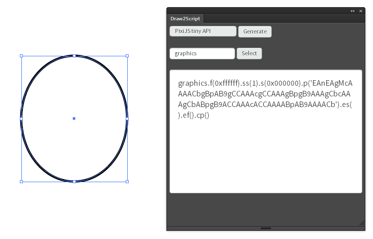

# Draw2Script
Export Source Code from Adobe Illustrator.  Inspired by [DrawScript](http://drawscri.pt/)

## Features

 * Supported Export Formats
   * EaselJS tiny API
   * PIXI_tiny API
   * PIXI_graphics
   * JSON
   
## Screenshot

## Installation using Extension Manager (Adobe CC2014 and CS6)
 * Install [Extension Manager](https://www.adobe.com/exchange/em_download/)
 * Run Draw2Script.zxp
 * If you have both CS6 and CC2014 installed together, Draw2Script may use the wrong version of Adobe Extension Manager and install the plugin for CS6 instead of CC2014, or vice versa
 
## Installation

# Adobe Illustrator CC

 * Visit [Adobe Add-ons](https://creative.adobe.com/addons/products/12429)
 * Search for Draw2Script
 * Click install
 * Draw2Script should be copied to your local drive via the Creative Cloud Desktop App
 * If you encounter problems visit https://www.adobeexchange.com/resources/19
  
## State

Beta State.
